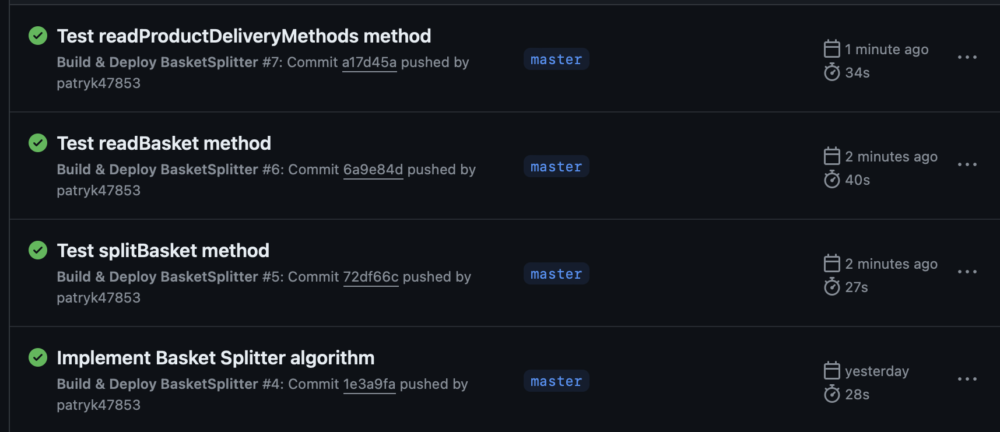

# 🧺 BasketSplitter - Your Ultimate Shopping Companion

* [📝 Description & Overview](#description)
* [🔧 Technologies](#technologies)
* [✨ Implementation details](#implementation)
* [🚀 How to Run?](#howtorun)

##  📝 Description & Overview

For an application aiming to enhance the functionality of an online supermarket, particularly in expanding its product range to include non-food items such as electronics and household goods. These items often cannot be delivered using standard delivery vehicles due to their size or because they are sourced from external suppliers, necessitating specialized courier services. However, it's crucial to note that not all products can be delivered by all means of delivery.

Given this scenario, the task is to optimally divide the items in a customer's online shopping basket into delivery groups. The goal is to minimize the number of required deliveries while ensuring that each delivery group is as large as possible. It has been observed that customers often choose to purchase items only from the largest delivery group, leaving the rest in their basket.

This project involves the creation of a library designed to split items in a customer's shopping basket into delivery groups efficiently. The primary objective is to minimize the number of required deliveries while maximizing the size of each delivery group. The library aims to optimize the delivery process for online supermarkets, particularly for scenarios where certain items require specialized courier services due to factors such as size or external sourcing.

##  🔧 Technologies

* Java 21 📚
* JUnit 5 🧪
* Maven 🛠️
* JSON.simple 📝
* GitHub Actions 🚀

##  📸 ✨ Implementation details

* #### CI (Continuous Integration) in action (via GitHub Actions)

##  🚀 How to Run?

* ###  Project

1. Clone this git repository: `$ git clone https://github.com/patryk47853/BasketSplitter.git`
2. Fetch all Maven dependencies.
3. That's it! Run tests to see it in action!
